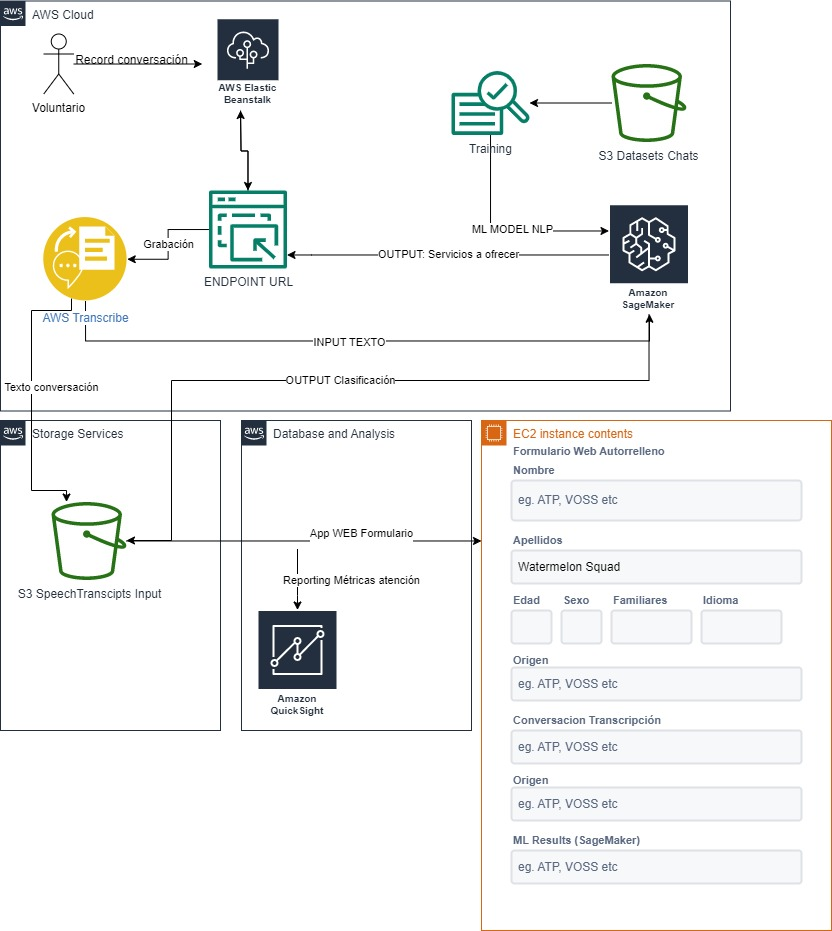

# Impact-DataInsights
# Data Insights and Automatic form filling - ImpactApp

Data tasks with recorded audio infomation and generated insights

Once we got the information from the recorded audio into the Bucket. We utilise the AWS SageMaker capabilities to process the data and generate insights table that feeds a QuickSight Report and report in the front end application and also extract a json formatted file to fulfill the form automatically.

Ideally, we want to develop the application to detect any new file in the bucket and process it and also apply a ML model where we could summarize the conversation with NLP techniques using Bert trained models which allows us to categorize every word and fill the form automatically. But, due to time restrictions and limits we accomplished the following tasks:

following the next arquitecture:

Following the next diagram 

We could describe the steps of the process as follows:

1. Once the file of the audio transcription is in the bucket. Every day during night shift we collect all the files in the bucket for that day and process them using the services of AWS SageMaker. From SageMaker we collect and apply them several transformations. 

2. We got two dataframes Insights dataframe where you could check the information of the recorded interviews and the logs metrics that AWS transcribe let once we use the service.

3. Using the dataframe "Insights" we proceed to ingest this data into AWS QuickSight to elaborate a reporting dashboard which could help Cruz Roja España to excel and improve their services using infomation.

4. Finally, we extract the data and got a json file that will be use to fill automatically the formulary and return this json to the S3 bucket where the API could take this files and show it to the Cruz Roja volunteers or users. 

Additionally, once we could have more time and resources we could train a NLP model to automatize the inference of the information from conversation transcriptions and feed the formularies automatically. All could be develop using the same arquitecture seen in the diagram. 
